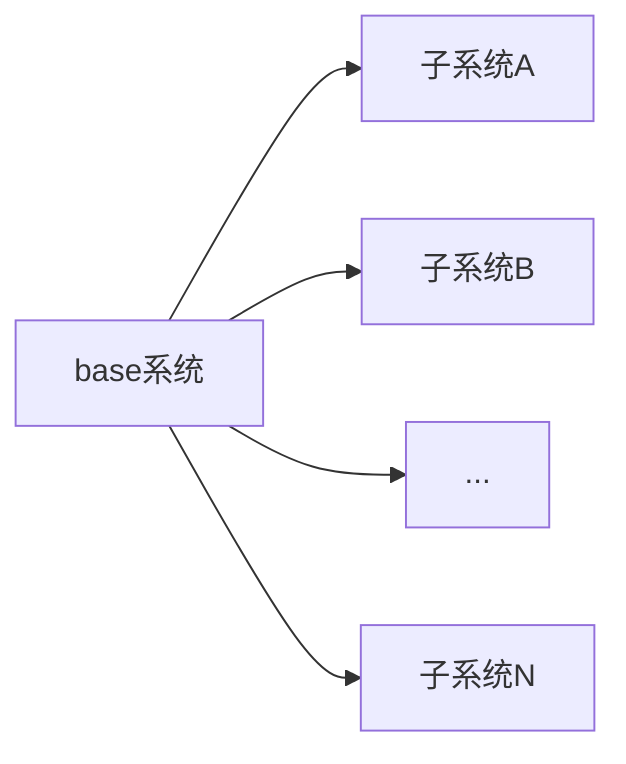

#  基于qiankunjs的微前端搭建

### 什么是qiankun

> [qiankun](https://qiankun.umijs.org/zh/guide): 一个基于 [single-spa](https://github.com/CanopyTax/single-spa) 的[微前端](https://micro-frontends.org/)实现库，旨在帮助大家能更简单、无痛的构建一个生产可用微前端架构系统。孵化自蚂蚁金融科技基于微前端架构的云产品统一接入平台

### 微前端基本架构



### 初始化子系统

> 这里使用react创建

```bash
# 1.首先使用create-react-app 创建一个项目
create-react-app child
# 2,.运行项目
# 3.修改打包配置， 使用第三方插件（@craco/craco， react-app-rewired） 任选一个就可以，我这边使用react-app-rewired
# 4.安装插件
yarn add -D react-app-rewired
# 5.新建配置文件, 在根目录创建 config-overrides.js文件
# 6.配置项目
module.exports = {
  webpack: function(config, env) {
    // 需要配置打包方式为umd， 
    config.output.library = 'reactApp2'
    config.output.libraryTarget = 'umd'
    config.output.publicPath = 'http://localhost:8888'
    config.output.filename = 'reactApp2.js'
    config.output.jsonpFunction = `webpackJsonp_reactApp2`
    /* 
    filename: 'single-spa-react-app.js',
    library: 'singleSpaReactApp',
      libraryTarget: 'umd',
      filename: 'single-spa-react-app.js' */
    return config;
  },
  // Extend/override the dev server configuration used by CRA
  // See: https://github.com/timarney/react-app-rewired#extended-configuration-options
  devServer: function(configFunction) {
    return function(proxy, allowedHost) {
      // Create the default config by calling configFunction with the proxy/allowedHost parameters
      // Default config: https://github.com/facebook/create-react-app/blob/master/packages/react-scripts/config/webpackDevServer.config.js
      // 加载项目需要制定url地址， 所以这里定义好端口
      const config = configFunction(proxy, allowedHost);
      config.port = 9999 // 如果端口设置没有生效。可以使用env配置端口
      // 加载资源时用的是fetch，所以会有跨域问题，这里配置跨域
      // Set loose allow origin header to prevent CORS issues
      config.headers = {'Access-Control-Allow-Origin': '*'}

      return config;
    };
  },
};

# 7.修改package.json
  "scripts": {
-   "start": "react-scripts start",
+   "start": "react-app-rewired start",
-   "build": "react-scripts build",
+   "build": "react-app-rewired build",
-   "test": "react-scripts test",
+   "test": "react-app-rewired test",
    "eject": "react-scripts eject"
}

```

### 修改子系统入口文件

> 首先，需要按照qiankun.js 约定 导出四个方法： bootstrap， mount， unmount， update
>
> 设置资源加载路径： __webpack_public_path__ = window.__INJECTED_PUBLIC_PATH_BY_QIANKUN__， 需要判断是否在qiankun内运行
>
> 环境判断： window.__POWERED_BY_QIANKUN__

```react
import React from 'react';
import ReactDOM from 'react-dom';
import './index.css';
import App from './App';
import reportWebVitals from './reportWebVitals';

function render(dom, props = {}) {
  // 123
  ReactDOM.render(
    <React.StrictMode>
      <App {...props} />
    </React.StrictMode>,
    dom
  );
  
}
// 如果是单独运行项目，则直接渲染
if (!window.__POWERED_BY_QIANKUN__) {
  render(document.getElementById('root2'))
  
}
// If you want to start measuring performance in your app, pass a function
// to log results (for example: reportWebVitals(console.log))
// or send to an analytics endpoint. Learn more: https://bit.ly/CRA-vitals
reportWebVitals();
if (window.__POWERED_BY_QIANKUN__) {
  // eslint-disable-next-line no-undef
  __webpack_public_path__ = window.__INJECTED_PUBLIC_PATH_BY_QIANKUN__;
}

/**
 * bootstrap 只会在微应用初始化的时候调用一次，下次微应用重新进入时会直接调用 mount 钩子，不会再重复触发 bootstrap。
 * 通常我们可以在这里做一些全局变量的初始化，比如不会在 unmount 阶段被销毁的应用级别的缓存等。
 */
export async function bootstrap() {
  console.log('react app bootstraped');
}
/**
 * 应用每次进入都会调用 mount 方法，通常我们在这里触发应用的渲染方法
 */
export async function mount(props) {
  let el = props.container ? props.container.querySelector('#root2') : document.getElementById('root2')
  render(el, props)
}
/**
 * 应用每次 切出/卸载 会调用的方法，通常在这里我们会卸载微应用的应用实例
 */
export async function unmount(props) {
  console.log('props', props)
  ReactDOM.unmountComponentAtNode(props.container ? props.container.querySelector('#root2') : document.getElementById('root2'));
}
/**
 * 可选生命周期钩子，仅使用 loadMicroApp 方式加载微应用时生效
 */
export async function update(props) {
  console.log('update props', props);
}
```

> 到此为止，子系统创建完毕

### 创建主应用系统

> base系统，既系统基座，通过这个系统，将其他系统集成起来

```basic
# 1.首先使用create-react-app 创建一个项目
create-react-app child
# 2.运行项目
# 3.安装qiankun插件
yarn add qiankun # 或者 npm i qiankun -S
# 4.在入口文件注册微应用

```

### 主应用入口文件修改

```react
// 主应用入口文件
import React from 'react';
import ReactDOM from 'react-dom';
import './index.css';
import App from './App';
import { registerMicroApps, start } from 'qiankun'


ReactDOM.render(
  <React.StrictMode>
    <App />
  </React.StrictMode>,
  document.getElementById('root')
);
// 微信用1
let child1 = {
  name: 'reactApp', // apppName 需要和子系统wepack配置的library对应
  container: '#reactApp', // 显示子应用的容器
  entry: 'http://localhost:9999', // 加载微应用url地址
  activeRule: '/reactApp', // 触发路由
  props: {} // 自定义属性
}
// 微信用2
let child2 = {
  event,
  name: 'reactApp2',
  container: '#reactApp2',
  entry: 'http://localhost:8888',
  activeRule: '/reactApp2',
  props: {}
}
// 注册微引用
registerMicroApps([child1, child2])
// 启动
start()


```

### 修改主应用APP文件

> 1. 新增子应用容器元素，ID使用注册是定义的子应用id
> 2. 添加路由，这里使用react-router

```react
// 主应用入口文件
import { Router, Link } from '@reach/router'
import './App.css';
import Home from './home'
function App() {
  return (
    <div className="">
      <header className="">
        react parent app
      </header>
      <nav>
         // 添加路由 切换微应用以及 主应内容
        <Link to="/">Home</Link> |{" "}
        <Link to="/reactApp">children</Link> |{" "}
        <Link to="/reactApp2">children2</Link>
      </nav>
      <Router>
        <Home path="/" />
      </Router>
        // 显示子应用
      <div className="layout">
          <div id="reactApp"></div>
          <div id="reactApp2"></div>
        </div>
    </div>
  );
}

export default App;
```

> 运行主应用
>
> 到这里， 我们就在完成了基本得微前端架构， 一个主应用。两个微应用

### 数据共享

> 这里使用qiankun提供的initGlobalState

1. 在主应用初始化status

```react
// 主应用入口文件
import React from 'react';
import ReactDOM from 'react-dom';
import './index.css';
import App from './App';
import { registerMicroApps, start, initGlobalState } from 'qiankun'
// 引入 initGlobalState， 创建一个共享数据
const actions = initGlobalState({
  status: 'base'
})
actions.onGlobalStateChange((state, prev) => {
  // state: 变更后的状态; prev 变更前的状态
  console.log(state, prev);
});

ReactDOM.render(
  <React.StrictMode>
    <App />
  </React.StrictMode>,
  document.getElementById('root')
);
// 微信用1
let child1 = {
  name: 'reactApp', // apppName 需要和子系统wepack配置的library对应
  container: '#reactApp', // 显示子应用的容器
  entry: 'http://localhost:9999', // 加载微应用url地址
  activeRule: '/reactApp', // 触发路由
  props: {} // 自定义属性
}
// 微信用2
let child2 = {
  event,
  name: 'reactApp2',
  container: '#reactApp2',
  entry: 'http://localhost:8888',
  activeRule: '/reactApp2',
  props: {}
}
// 注册微引用
registerMicroApps([child1, child2])
// 启动
start()

```

### 微应用修改

> 在子应用入口文件导出的mount方法中新增如下内容

```js
// 从生命周期 mount 中获取通信方法，使用方式和 master 一致
export function mount(props) {
  props.onGlobalStateChange((state, prev) => {
    // state: 变更后的状态; prev 变更前的状态
    console.log(state, prev);
  });
   // 更新数据
  props.setGlobalState(state);
}
```

### 微应用之间通信

> 这边我是使用了发布订阅，实现 应用之间通信

1. 在主应用下新增发布订阅文件

   ```javascript
   // 临时手写 减少代码量，项目中请参照node event模块自行分装
   const event = {
     clientList: {},
     listen (key, fn) {
         if (!this.clientList[key]) {
             this.clientList[key] = []
         }
         this.clientList[key].push(fn)   // 订阅的消息添加进缓存列表
     },
     trigger (type, money) {
         let fns = this.clientList[type]
         if (!fns || fns.length === 0) { // 如果没有绑定对应的消息
             return false
         }
         fns.forEach(fn => {
             fn.apply(this, [money])
         })
     }
   }
   export default event
   ```

   

2. 导入发布订阅文件，并通过自定props传递给子应用

   ```react
   // 主应用入口文件
   import React from 'react';
   import ReactDOM from 'react-dom';
   import './index.css';
   import App from './App';
   import { registerMicroApps, start, initGlobalState } from 'qiankun'
   // 组件之间通信
   import event from './utils/event'
   // 引入 initGlobalState， 创建一个共享数据
   const actions = initGlobalState({
     status: 'base'
   })
   actions.onGlobalStateChange((state, prev) => {
     // state: 变更后的状态; prev 变更前的状态
     console.log(state, prev);
   });
   
   ReactDOM.render(
     <React.StrictMode>
       <App />
     </React.StrictMode>,
     document.getElementById('root')
   );
   // 微信用1
   let child1 = {
     name: 'reactApp', // apppName 需要和子系统wepack配置的library对应
     container: '#reactApp', // 显示子应用的容器
     entry: 'http://localhost:9999', // 加载微应用url地址
     activeRule: '/reactApp', // 触发路由
     props: { event } // 自定义属性
   }
   // 微信用2
   let child2 = {
     event,
     name: 'reactApp2',
     container: '#reactApp2',
     entry: 'http://localhost:8888',
     activeRule: '/reactApp2',
     props: { event }
   }
   // 注册微引用
   registerMicroApps([child1, child2])
   // 启动
   start()
   ```

   

3. 子应用订阅/触发事件

   > 子应用需要从props中拿到event对象，然后订阅/ 触发事件

   ```react
   /**
   * @desc 发布事件
   */
   const setChange = () => {
   props.setGlobalState({status: 'App1'})
   }
   // 接收事件
   const onChange = (...args) => {
   console.log('onchange App1', ...args)
   }
   /**
   * @desc app2 出发event
   */
   const triggerEvent = () => {
   props.event.trigger('app2listener', 'app1 trigger')
   }
   /**
   * @desc app2监听event
   * @param  {...any} args 
   */
   const listener = (...args) => {
   console.log('app1 listenter', args)
   }
   // 微应用时才运行
   if (window.__POWERED_BY_QIANKUN__) {
   props.onGlobalStateChange(onChange)
   props.event.listen('app1listener', listener)
   }
   ```

   ### 结束语

   > 到这里， 微前端架构的数据共享，应用通信已经完成，关于动态注册应用，样式隔离, 抽离公共依赖库等优化可以自行查看文档，个人公司没有使用该架构，这里只用来学习，相对demo会比较粗糙
   >
   > [最后附上完成代码]( https://github.com/corner1990/dream/tree/master/src/mic-front)